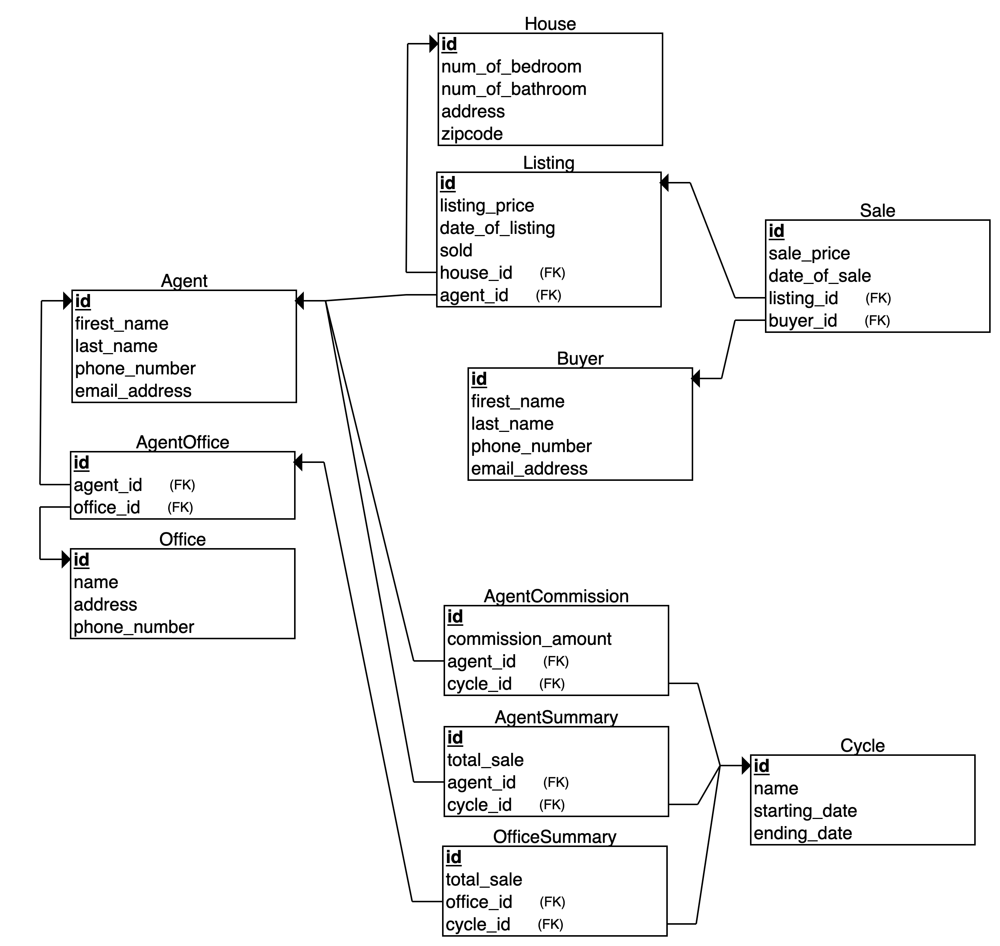

# real-estate-db

## Get Started

Clone the application from GitHub
```
git clone git@github.com:Boyu1997/real-estate-db.git
```

Change to the project directory
```
cd real-estate-db
```

Install virtual environment
```
python3 -m venv env
```

Activate virtual environment
```
source env/bin/activate
```

Install dependencies
```
pip3 install -r requirements.txt
```

Run the database application
```
python3 main.py
```

Test the database application
```
python3 test.py
```

## Database Design

### Agent and Office

Agent and office are two separate tables with a pivot table AgentOffice to accommodate the many to many relationships.

### Listing and Sale

Listing and sale are fundamentally different activities for a house. To reflect that relation, a house table is used to record physical information of the property, with listing and sale being two separate tables describing the activities of listing and sale. This seperation also better accommodates a house being listed and sold multiple times.

As listing and sale may be made by different agent and office (e.g. an agent left his or her job so that the actual sale is made by a different agent, a new office opens so the coverage of offices changed)  both tables record the agent and office correlate to the activity.

### Summary and Commission
Because agents can belong to multiple offices, the summary table is best to record and update according to agents and offices. For that reason, two tables are made to record agent summary and office summary. For commission, as only agents get commission, one commission table is sufficient.
Another concept introduced to better record the data is the cycle table. As information is combined and reported monthly, it makes the most sense to order the summary and commission in the same manner. So all the three tables will reference the cycle table at an identifier of the issue of the monthly report.


## ERD Diagram

